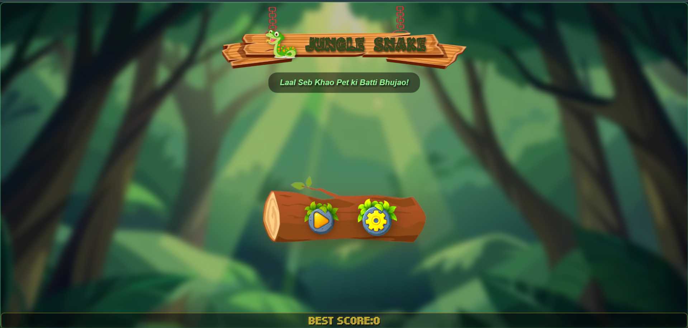
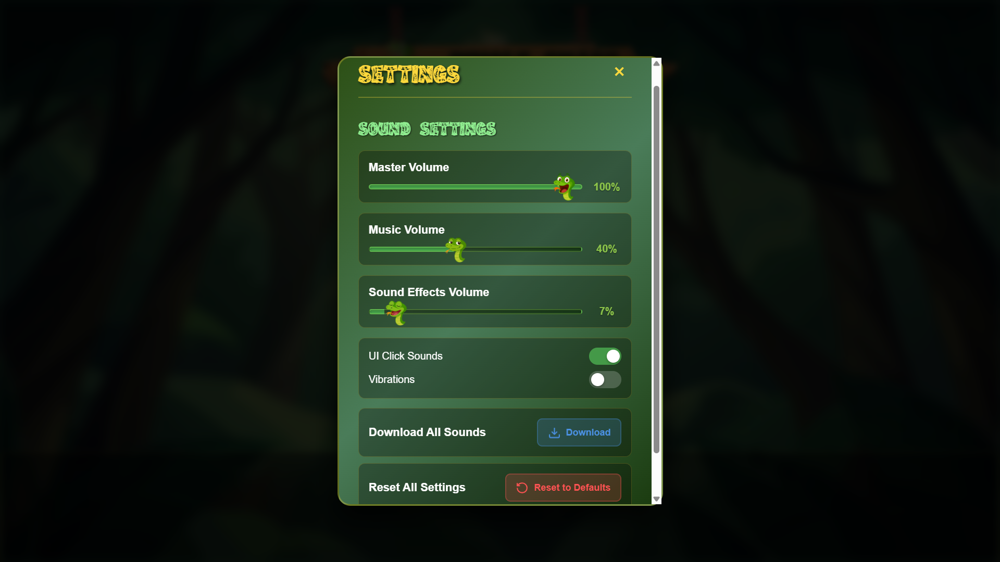
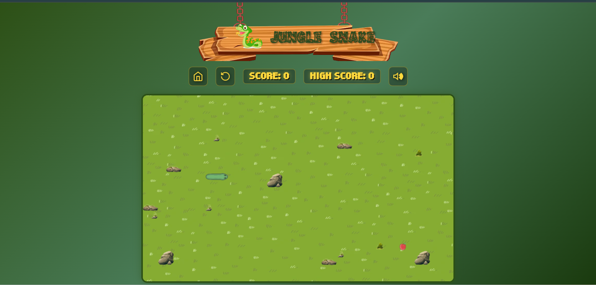
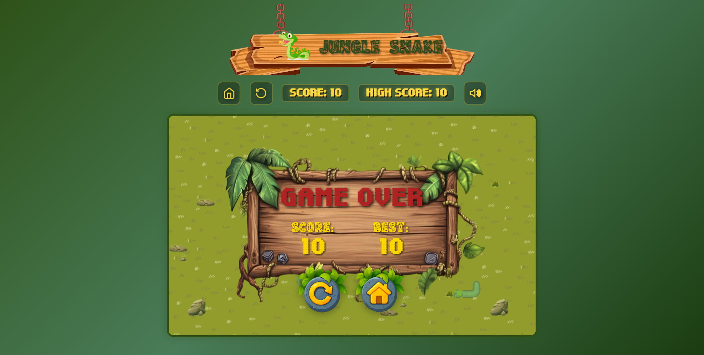

# 🐍 Jungle Snake

A beautifully crafted, jungle-themed Snake game built with pure HTML5, CSS3, and JavaScript. Experience the classic gameplay with modern visuals, immersive audio, and smooth animations in a lush jungle environment.

## 🎮 Demo & Screenshots

### Start Screen

*Immersive jungle-themed start screen with atmospheric lighting*

### Audio Settings

*Comprehensive audio control system with volume sliders and toggles*

### Gameplay

*Classic snake gameplay with jungle aesthetics and obstacle challenges*

### Game Over

*Wooden game over board with score display and retry options*

## ✨ Features

### 🎮 Core Gameplay
- Classic Snake mechanics with modern enhancements
- Intelligent obstacle generation with safe spawn zones
- Multiple obstacle types (1-block, 2-block, 4-block rocks)
- Smooth snake movement with realistic body physics
- Score tracking with persistent high score storage

### 🎨 Visual Design
- Stunning jungle theme with atmospheric backgrounds
- Custom-designed snake with mint green coloring and coral accents
- Animated snake features (mouth opening, tongue flicking, eye animations)
- Responsive design supporting desktop and mobile devices
- Smooth transitions and particle effects

### 🎵 Audio System
- Comprehensive Web Audio API implementation
- Background music with jungle ambiance
- Dynamic sound effects for all game actions
- Individual volume controls (Master, Music, SFX)
- UI click sounds and hover effects
- Audio download functionality

### 🔧 Technical Features
- **Offline Support**: Full PWA with Service Worker caching
- **Performance Optimized**: 60 FPS gameplay with adaptive frame rate
- **Asset Caching**: Advanced localStorage caching system
- **Security**: Client/server separation with interaction restrictions
- **Cross-Platform**: Vibration support for mobile and gamepad controllers

### ⚙️ Advanced Settings
- Master Volume control (0-100%)
- Music Volume control (0-100%)
- Sound Effects Volume control (0-100%)
- UI Click Sounds toggle
- Vibration feedback toggle
- Settings persistence across sessions
- One-click reset to defaults

## 🚀 Installation

### Quick Start (Replit)
1. **Clone the project** to your Replit workspace
2. **Install dependencies**:
   ```bash
   # Dependencies are auto-installed from pyproject.toml
   # Includes: Python 3.11, numpy, pillow
   ```
3. **Start the server**:
   ```bash
   python serve.py
   ```
4. **Open your browser** to `http://localhost:5000`

### Local Development
1. **Clone the repository**:
   ```bash
   git clone <repository-url>
   cd jungle-snake
   ```

2. **Install Python dependencies**:
   ```bash
   pip install -r requirements.txt
   # or if using pyproject.toml:
   pip install numpy>=2.3.1 pillow>=11.3.0
   ```

3. **Start the development server**:
   ```bash
   python serve.py
   ```

4. **Access the game** at `http://localhost:5000`

### Static Hosting
The game can also be served from any static web server:
```bash
# Using Python's built-in server
python -m http.server 8000

# Using Node.js serve
npx serve .

# Using any other static file server
```

## 🎯 How to Play

### Basic Controls
- **Arrow Keys**: Control snake movement (↑↓←→)
- **Mouse**: Navigate menus and settings
- **Touch**: Mobile-friendly touch controls

### Gameplay Rules
1. **Objective**: Eat food to grow your snake and increase your score
2. **Avoid**: Walls, obstacles, and your own body
3. **Scoring**: Each food item eaten increases your score by 10 points
4. **Growth**: Snake grows longer with each food consumed
5. **Challenge**: Navigate around randomly placed rock obstacles

### Game Features
- **Snake Animation**: Watch the snake's mouth open when approaching food
- **Tongue Animation**: Random tongue flicking adds personality
- **Hit Effects**: Screen shake and knockback on collisions
- **Safe Zones**: Snake starts in a safe area free from obstacles

### Settings & Customization
- **Audio Controls**: Adjust master, music, and SFX volumes independently
- **Sound Options**: Toggle UI click sounds and vibration feedback
- **Developer Mode**: Press `Ctrl+Shift+D` for development tools

## 🛠️ Technologies Used

### Frontend
- **HTML5**: Semantic markup and Canvas API for game rendering
- **CSS3**: Advanced styling with animations and responsive design
- **JavaScript (ES6+)**: Pure vanilla JavaScript with modern features

### Audio & Media
- **Web Audio API**: Dynamic sound generation and processing
- **WebP Images**: Optimized image format for faster loading
- **MP3 Audio**: Compressed audio files for web delivery

### Performance & Caching
- **Service Workers**: PWA functionality and offline support
- **localStorage**: Client-side data persistence and asset caching
- **RequestAnimationFrame**: Optimized 60 FPS game loop

### Development Tools
- **Python 3.11**: Development server with HTTP handling
- **UV/Pip**: Package management
- **Asset Optimization**: Custom tools for sprite processing

### Browser APIs
- **Canvas 2D**: High-performance graphics rendering
- **Vibration API**: Haptic feedback support
- **Gamepad API**: Controller vibration support
- **Audio Context**: Advanced audio processing

## 📁 Project Structure

```
jungle-snake/
├── assets/                 # Game assets and media files
│   ├── audio/             # Sound effects and background music
│   ├── backgrounds/       # Jungle and UI background images
│   ├── buttons/           # UI button sprites and icons
│   ├── fonts/             # Custom game fonts
│   ├── obstacles/         # Rock and obstacle sprites
│   ├── snake/             # Snake skin and sprite assets
│   └── screenshots/       # Demo screenshots
├── .local/                # Replit configuration
│   └── state/replit/agent/
│       └── progress_tracker.md
├── index.html             # Main game HTML structure
├── style.css              # Complete styling and animations
├── game.js                # Core game logic and rendering
├── audio.js               # Audio system and Web Audio API
├── asset-loader.js        # Asset preloading and caching
├── dev-toggle.js          # Developer tools and restrictions
├── offline-manager.js     # PWA and offline functionality
├── service-worker.js      # Service Worker for caching
├── sw-cleanup-utility.js  # Development cache management
├── serve.py               # Python development server
├── pyproject.toml         # Python dependencies
├── replit.md              # Project documentation
└── README.md              # This file
```

### Key Files
- **`game.js`**: Main game engine with Snake class and collision detection
- **`audio.js`**: Comprehensive audio system with Web Audio API
- **`asset-loader.js`**: Smart asset loading with cache management
- **`style.css`**: Responsive design with jungle theme styling
- **`service-worker.js`**: PWA support for offline gameplay

## 🤝 Contributing

We welcome contributions to improve Jungle Snake! Here's how you can help:

### Getting Started
1. **Fork the repository**
2. **Create a feature branch**: `git checkout -b feature/amazing-feature`
3. **Make your changes** and test thoroughly
4. **Commit your changes**: `git commit -m 'Add amazing feature'`
5. **Push to the branch**: `git push origin feature/amazing-feature`
6. **Open a Pull Request**

### Development Guidelines
- **Code Style**: Use consistent JavaScript ES6+ syntax
- **Testing**: Test on multiple browsers and devices
- **Performance**: Maintain 60 FPS gameplay performance
- **Assets**: Optimize images and audio files
- **Documentation**: Update README.md for significant changes

### Areas for Contribution
- **New Skins**: Create additional snake and food skins
- **Sound Effects**: Enhance audio with new jungle sounds
- **Game Modes**: Add difficulty levels or special game modes
- **Mobile Optimization**: Improve touch controls and responsiveness
- **Accessibility**: Add keyboard navigation and screen reader support

## 📄 License

This project is licensed under the **MIT License** - see the [LICENSE](LICENSE) file for details.

```
MIT License

Copyright (c) 2025 Jungle Snake Game

Permission is hereby granted, free of charge, to any person obtaining a copy
of this software and associated documentation files (the "Software"), to deal
in the Software without restriction, including without limitation the rights
to use, copy, modify, merge, publish, distribute, sublicense, and/or sell
copies of the Software, and to permit persons to whom the Software is
furnished to do so, subject to the following conditions:

The above copyright notice and this permission notice shall be included in all
copies or substantial portions of the Software.
```

## 🎨 Credits & Acknowledgments

### Design & Development
- **Game Design**: Original Snake concept with modern jungle theme
- **Audio Design**: Web Audio API synthesis for cartoonish sound effects
- **Visual Assets**: Custom-designed sprites and jungle environments
- **Performance Optimization**: Advanced caching and rendering techniques

### Technologies & Inspiration
- **HTML5 Canvas**: For high-performance 2D graphics
- **Web Audio API**: For dynamic sound generation
- **Service Workers**: For PWA functionality
- **Classic Snake**: Inspired by the timeless arcade game

### Special Thanks
- **Replit Community**: For providing an excellent development platform
- **Web Standards**: HTML5, CSS3, and modern JavaScript APIs
- **Open Source Community**: For inspiration and best practices

## 📧 Contact

### Developer
- **GitHub**: [jatinsharma0e0](https://github.com/jatinsharma0e0)
- **Email**: jatin0e0help@gmail.com

### Feedback & Support
- **Bug Reports**: Please open an issue on GitHub
- **Feature Requests**: Submit suggestions via GitHub Issues
- **General Questions**: Reach out via email or Replit DMs

### Project Links
- **Live Demo**: [Play Jungle Snake](https://junglesnakegame.vercel.app)
- **Source Code**: [GitHub Repository](https://github.com/jatinsharma0e0/classic-snake-game)
- **Development Log**: See `replit.md` for detailed change history

---

**Happy Gaming! 🐍🌿**

*Experience the thrill of classic Snake gameplay in a beautiful jungle setting. Master the art of snake navigation while enjoying immersive audio and stunning visuals.*